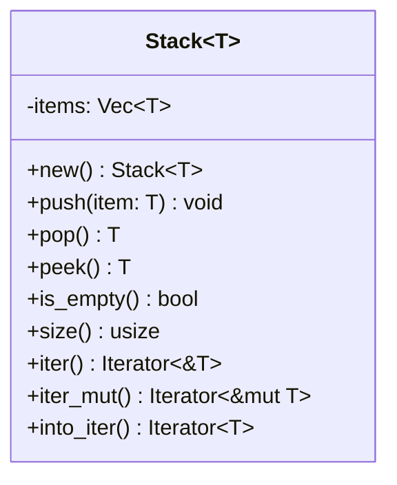

# Algorithms and Data Structures in Rust (WIP)

## About
This is a personal attempt at implementing some known algorithms and data structures using the Rust programming language. This is mostly for learning purposes.

The idea is to do some research on some data structure or algorithm, write some notes about it in this same README then start implementing it with some tests.

The structure of the Cargo project is very simple: a main Cargo workspace inside which there's cargo sub-projects for each data structure or algorithm. This gives us the ability to add tests specific to every sub-project for more modularity.

Since it's known that implementing data structures and algorithms in a verbose language like *Rust* is a harder than using more expressive languages like *Python*, I think it's still a doable thing if we use *generics*, this will keep the compiler happy while giving us some freedom to skip some verbosity in our final code.

## Stack
- A *stack* is a *linear* data structure that contains an ordered collection of items.
- New items are added or removed from the top in LIFO manner.

### Exposed API

